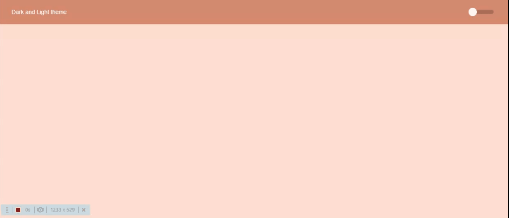

# Light and Dark Theme switcher

React app desenvolvido para demonstrar a funcionaliade de troca de tema claro e escuro com persistência de dados da escolha do tema do usuário.

## Interface web

### Tecnologias

- Typescript
- React
- Styled Components
- LocalStorage (persistência)

---------------------

Para rodar o projeto em modo de desenvolvimento basta utilizar o comando abaixo na pasta raiz:

### `yarn start`

Abra o projeto em [http://localhost:3000](http://localhost:3000) para ve-lo no navegador.

This project was bootstrapped with [Create React App](https://github.com/facebook/create-react-app).